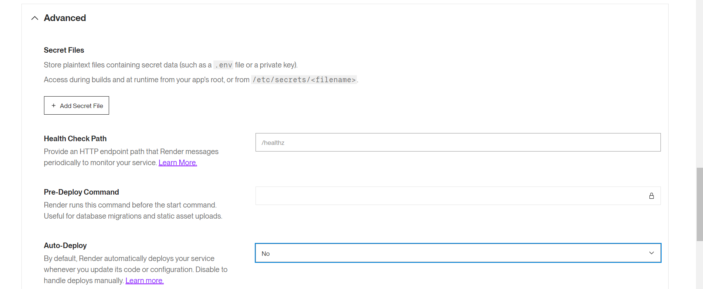
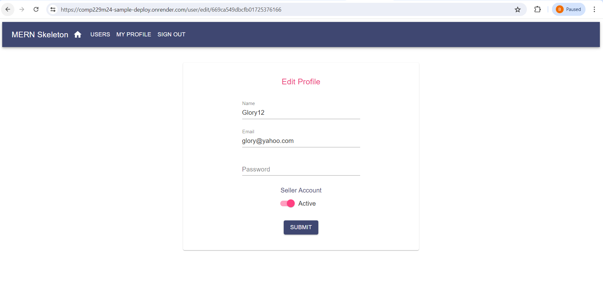

# Products Deploymeny

Click on New

Click on web service

Select the GitHUB repository where you have your files pushed to where
you want to deploy from

Click on connect

Follow the steps below and make necessary modification

Select free

Add the node version you use in developing your app. Advisably should be
as from version 16 and above will not work with version lower than 16.

Set the NODE_VERSION to a value higher than 16 i.e 16.18.1 and MONGODB_URI to the MongoDB connection string.

Click on Advanced, set Auto-Deploy to Yes.

Click on Deploy Web Services

Set Auto-Deploy to Yes

Click on Deploy Web service

Open the render url in the browser window

<https://comp229m24-sample-deploy.onrender.com/>

